# 🦷 Dental Clinic WhatsApp AI Agent

AI WhatsApp Agent for Dental Clinics that automates appointment bookings, handles patient inquiries, and manages emergencies. Built with n8n, OpenAI GPT-4o-mini, PostgreSQL, and Google Sheets. Saves time, reduces staff workload, and operates 24/7.

---

## 📸 Project Overview

<div align="center">
  <table>
    <tr>
      <td>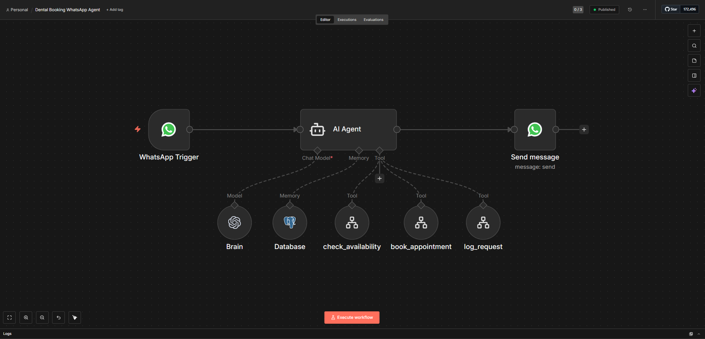<br/><i>Main Workflow</i></td>
      <td>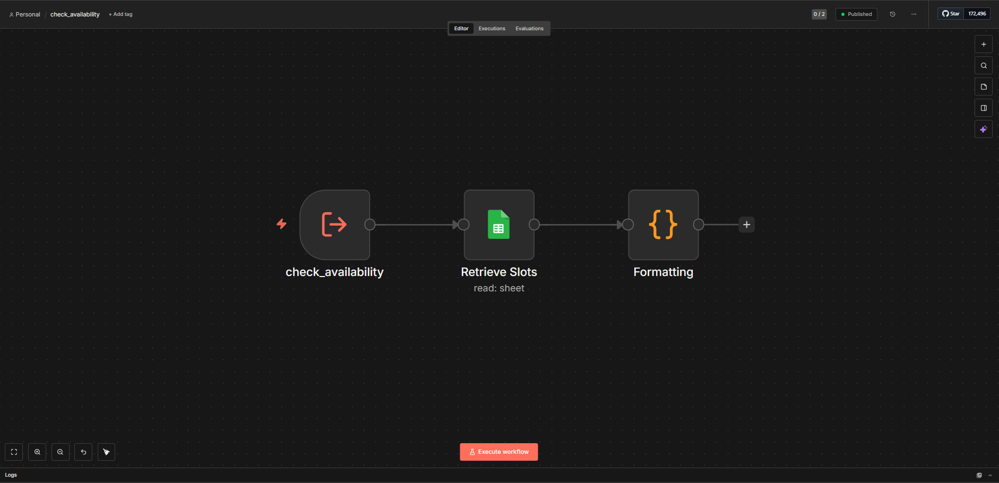<br/><i>Check Availability Sub-Workflow</i></td>
    </tr>
    <tr>
      <td>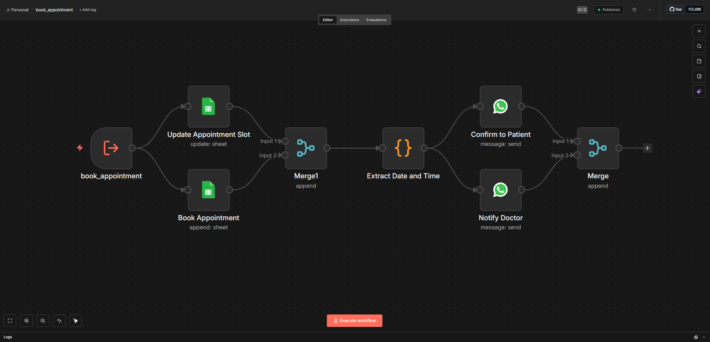<br/><i>Book Appointment Sub-Workflow</i></td>
      <td>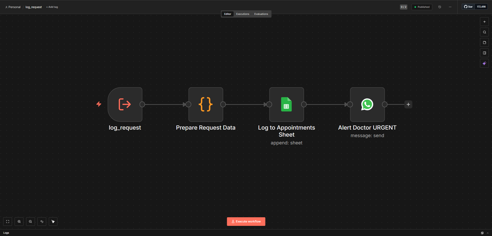<br/><i>Log Request Sub-Workflow</i></td>
    </tr>
    <tr>
      <td>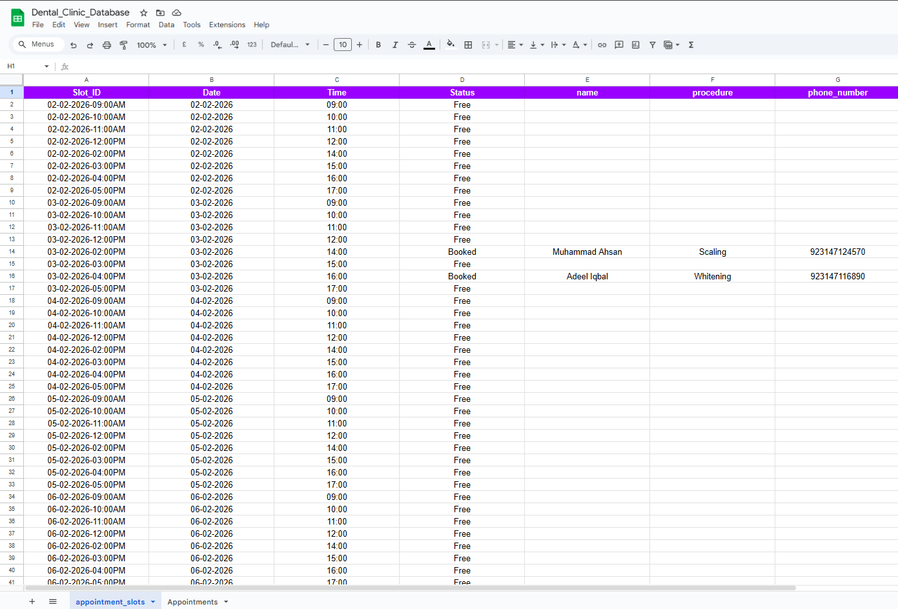<br/><i>Appointment Slots Sheet</i></td>
      <td>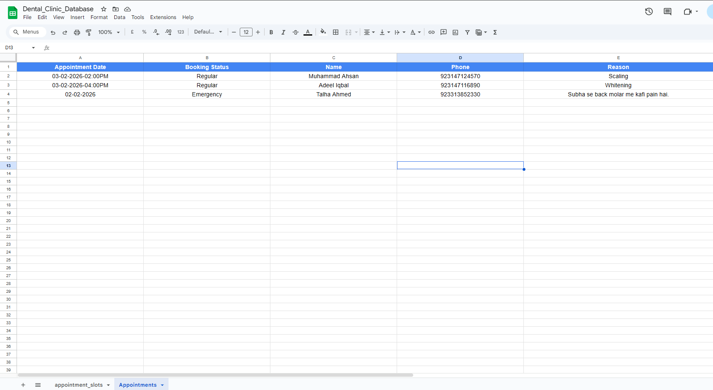<br/><i>Appointments Log Sheet</i></td>
    </tr>
  </table>
</div>

<div align="center">
  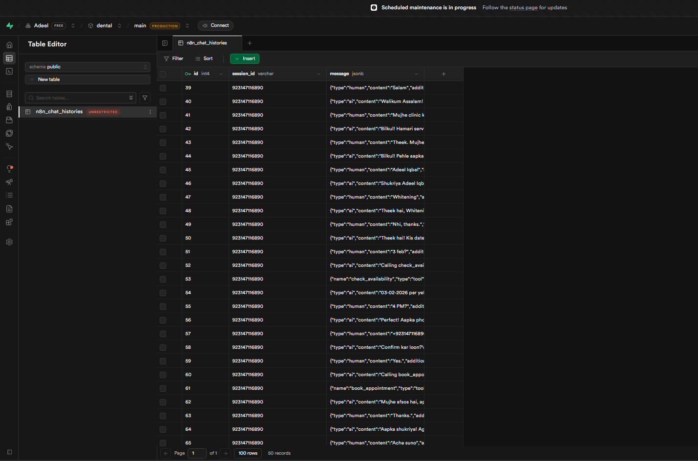
  <br/><i>PostgreSQL Database Structure</i>
</div>

---

## 📱 Live Demo Conversation

<div align="center">
  <table>
    <tr>
      <td>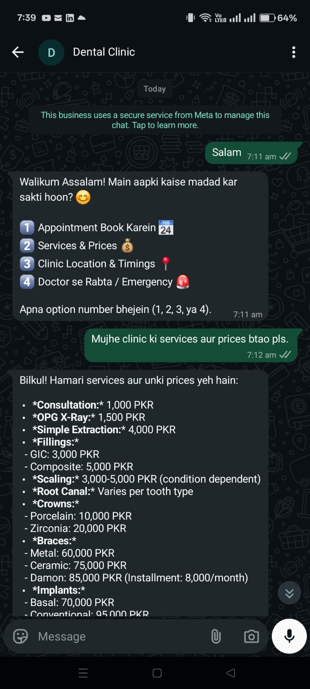</td>
      <td>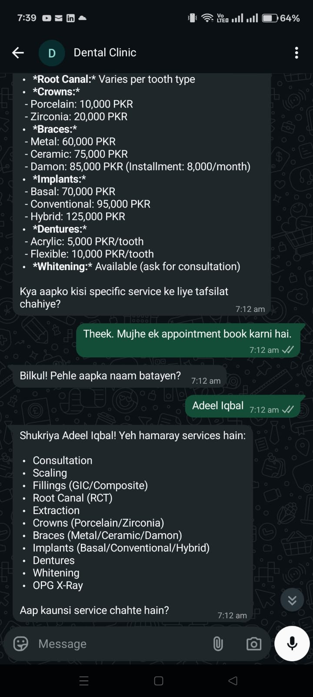</td>
      <td>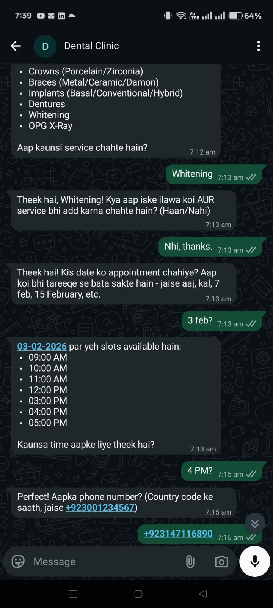</td>
    </tr>
    <tr>
      <td>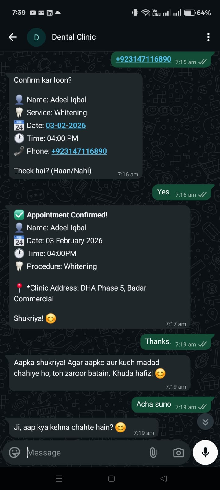</td>
      <td>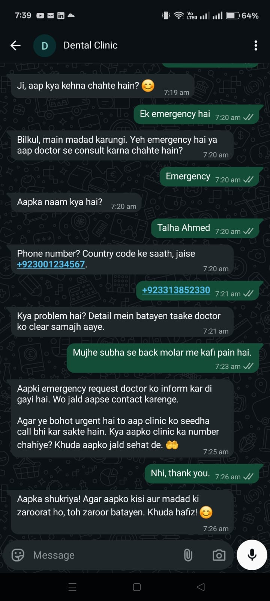</td>
      <td>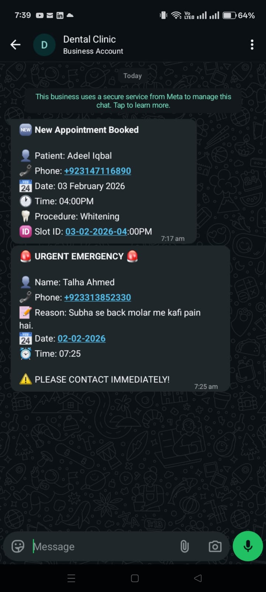</td>
    </tr>
  </table>
</div>

---

## 🎯 The Problem

Dental clinics face daily operational challenges:

- **Staff Overwhelm**: Receptionists spend 60-70% of their time on phone calls for bookings and inquiries
- **After-Hours Requests**: Patients calling outside clinic hours (nights, weekends) get no response
- **Missed Opportunities**: Every unanswered call = potential lost patient
- **Manual Errors**: Double bookings, scheduling conflicts, missing patient details
- **Emergency Delays**: Critical cases waiting for callback instead of immediate attention

**Business Impact:**
- 💰 Lost revenue from missed appointments
- ⏰ Staff time wasted on repetitive tasks
- 😞 Poor patient experience
- 📉 Lower customer retention

---

## ✅ The Solution

An intelligent **WhatsApp AI Agent** that operates 24/7, handling everything automatically:

### What It Does:

1. **📅 Appointment Booking**
   - Shows available time slots in real-time
   - Handles multiple services in one booking (e.g., "Scaling + Whitening")
   - Converts natural language dates ("kal", "7 feb", "next Monday") to proper format
   - Auto-formats phone numbers
   - Sends instant confirmations to both patient and doctor

2. **💰 Services & Pricing Information**
   - Answers pricing questions instantly
   - Provides details about treatments (RCT, implants, braces, etc.)
   - Handles FAQs (pain, duration, payment plans)

3. **📍 Location & Timings**
   - Shares clinic address and Google Maps link
   - Provides operating hours

4. **🚨 Emergency Handling**
   - Immediate doctor notification via WhatsApp
   - Logs emergency details with timestamp
   - Provides emergency contact number

### Why This Saves Money & Time:

| Before (Manual) | After (AI Agent) | Savings |
|----------------|------------------|---------|
| Receptionist handles 50-60 calls/day | AI handles unlimited conversations simultaneously | **60-70% staff time freed** |
| After-hours calls = lost patients | 24/7 automated response | **~30% more bookings** |
| 5-10 min per booking call | Instant automated booking | **~200+ hours/month saved** |
| Manual entry errors → rescheduling costs | Automated data entry → zero errors | **Reduced operational costs** |
| Delayed emergency response | Instant doctor notification | **Better patient outcomes** |

**Average ROI:** Clinics save **$1,500-2,500/month** in operational costs while increasing patient bookings by 25-35%.

---

## 🏗️ How It Works

### Architecture Overview

```
User (WhatsApp) 
    ↓
AI Agent (n8n + OpenAI GPT-4o-mini)
    ↓
3 Sub-Workflows:
    ├─ check_availability → Google Sheets
    ├─ book_appointment → Google Sheets + WhatsApp Notifications
    └─ log_request → Google Sheets + Emergency WhatsApp Alert
    ↓
Data Storage:
    ├─ Google Sheets (Appointments & Slots)
    └─ PostgreSQL (Chat History)
```

### Main Workflow
The AI Agent acts as a smart receptionist, understanding natural language in Urdu/Roman Urdu and English. It:
- Greets patients and presents a menu
- Routes requests to appropriate sub-workflows
- Maintains conversation context using memory
- Handles date/time/phone number conversions intelligently

### Sub-Workflows

**1. check_availability**
- Takes date input (in any format)
- Queries Google Sheets for available slots
- Filters only "Free" slots
- Returns formatted list to AI Agent

**2. book_appointment**
- Updates appointment slot status to "Booked"
- Logs booking in Appointments sheet
- Extracts readable date/time from slot ID
- Sends confirmation WhatsApp to patient
- Sends notification WhatsApp to doctor
- All operations run in parallel for speed

**3. log_request**
- Captures emergency or doctor consultation requests
- Gets current date/time automatically
- Appends to Appointments sheet with status
- Sends URGENT WhatsApp alert to doctor immediately

### Data Flow

**Google Sheets Structure:**

**Sheet 1: `appointment_slots`**
| Slot_ID | Date | Time | Status | name | procedure | phone_number |
|---------|------|------|--------|------|-----------|--------------|
| 06-02-2026-10:00AM | 06-02-2026 | 10:00 AM | Free | | | |
| 06-02-2026-11:00AM | 06-02-2026 | 11:00 AM | Booked | Ahmed Khan | Scaling / Whitening | +923001234567 |

**Sheet 2: `Appointments`**
| Appointment Date | Booking Status | Name | Phone | Reason |
|------------------|----------------|------|-------|--------|
| 06-02-2026 | Regular | Ahmed Khan | +923001234567 | Scaling / Whitening |
| 06-02-2026 | Emergency | Sara Ali | +923009876543 | Severe tooth pain |

---

## 🛠️ Tech Stack

| Technology | Purpose |
|------------|---------|
| **n8n** | Workflow automation platform |
| **OpenAI GPT-4o-mini** | Natural language understanding & conversation |
| **Google Sheets** | Real-time appointment database |
| **PostgreSQL** | Chat history & conversation memory |
| **WhatsApp Business API** | Patient communication channel |
| **JavaScript/Node.js** | Custom logic in Code nodes |

---

## 🎨 Key Features

✅ **Bilingual Support**: Understands Urdu, Roman Urdu, and English  
✅ **Smart Date Processing**: Converts "kal", "7 feb", "next Monday" automatically  
✅ **Multi-Service Booking**: Handles multiple procedures in one appointment  
✅ **Phone Normalization**: Auto-formats numbers to +92 standard  
✅ **Context Memory**: Remembers conversation flow  
✅ **Parallel Processing**: Fast execution with simultaneous operations  
✅ **Error Handling**: Graceful fallbacks for edge cases  
✅ **Real-time Notifications**: Instant WhatsApp alerts to doctor  
✅ **24/7 Availability**: Never misses a patient inquiry  

---

## 💼 Want This for Your Business?

This WhatsApp AI Agent is **fully customizable** for any dental clinic or medical practice.

### What You Get:
- ✅ Complete n8n workflows ready to deploy
- ✅ Customized for your clinic's services & pricing
- ✅ Your branding and clinic details
- ✅ Google Sheets templates configured
- ✅ WhatsApp Business API integration
- ✅ Full documentation & setup guide
- ✅ 30 days of support

### Customization Options:
- 🎨 Your clinic's services, prices, and timings
- 🌍 Multi-language support (add any language)
- 📊 Integration with your existing CRM/database
- 🔔 Custom notification preferences
- 📈 Analytics dashboard (track bookings, response times, etc.)
- 🤖 Extended AI capabilities (treatment recommendations, follow-ups)

---

## 📞 Contact

**Interested in deploying this for your clinic?**

📧 **Email:** adeelmemon096@yahoo.com  
💬 **WhatsApp:** [+92 314 711 6890](https://wa.me/923147116890)  
🔗 **LinkedIn:** [linkedin.com/in/adeeliqbalmemon](https://linkedin.com/in/adeeliqbalmemon)  
💻 **GitHub:** [github.com/adeel-iqbal](https://github.com/adeel-iqbal)

---

## 📄 License

This project is available for commercial licensing. Contact for pricing and customization.

---

## 🙏 Acknowledgments

Built with care for dental clinics looking to modernize their patient communication and reduce operational overhead.

**For Recruiters:** This project demonstrates expertise in:
- AI/LLM integration (OpenAI GPT-4)
- Workflow automation (n8n)
- Natural Language Processing
- API integrations (WhatsApp Business API)
- Database design (Google Sheets, PostgreSQL)
- JavaScript/Node.js programming
- User experience design for conversational AI
- Production-ready system architecture

---

<div align="center">
  <b>⭐ Star this repo if you find it helpful!</b>
</div>
